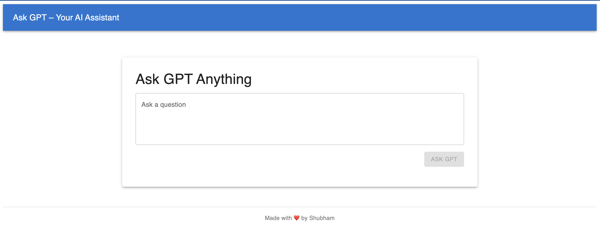

# 🧠 Ask GPT – AI Assistant Web App

A modern React-based AI assistant powered by OpenAI's GPT-3.5-turbo.
This adds use of RAG to pull info from some texts files as well.
Type in any question and get intelligent, conversational answers in real time.


---

## ✨ Features

- ⚡ Built with React + Material UI
- 🤖 Powered by OpenAI GPT-3.5 API
- 💬 Chat-style prompt + AI response
- 🔐 API key via `.env` (secured)

---


## 🛠️ Tech Stack

- **Frontend:** React (Vite), Material UI (MUI)
- **AI Model:** OpenAI GPT-3.5 via REST API
- **Styling:** MUI theme + custom layout
- **Hosting:** Vercel (or Netlify recommended)

---

## 🚀 Getting Started

### 1. Clone this repo

```bash
git clone https://github.com/shubhamstrength/basicgpt
cd basicgpt
```

### 2. Install Dependencies

```bash
npm install
```
### 3. Set up your OpenAI API Key
Create a .env file in the root:

```bash
VITE_OPENAI_API_KEY=sk-xxxxxxxxxxxxxxxxxxxxxxxxxxxx
```

###4. Run locally
```bash
 npm run dev
 ```
